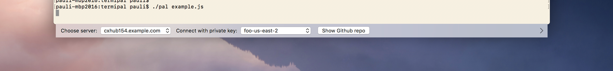

# Termipal

The Unix command line is powerful... But interactivity isn't its strong suit. There are text-mode UIs like curses, but they're not easy to develop, feel archaic to many users and can't interface with the desktop environment.

Termipal is a small and fast GUI utility that lets you create minimal user interfaces using an easy JSON format.

The UIs you create are fully native using the macOS Cocoa API. They have access to desktop APIs like open panels for picking files, opening links in other apps, etc.

For maximum convenience, Termipal automatically attaches to the bottom edge of your terminal window. This way it's right next to where you're typing. This feature works with the standard Mac Terminal as well as replacements like iTerm.

Termipal — let it be your Terminal's new best pal. *&ast;cringe&ast;*

### How it works

Termipal is actually a small framework for building JavaScript apps, like Electron.

“Wait, that sounds terrible,” you may be thinking — isn't JavaScript slow and a memory hog? 
The answer is: No, not when it's separated from the web browser.

JavaScript itself is fast and lightweight. It's the browser that makes Electron apps so big. 
Termipal's entire install is a single binary which is only 150 kB in size.

There's no browser engine in Termipal. It doesn't use HTML or CSS — user interfaces are defined simply as JSON objects. It doesn't even embed a JavaScript runtime; instead it uses the one that comes with macOS and is probably already loaded in your Mac's memory because it's a system component.

The APIs in Termipal are similar to Electron where possible. For example, you can listen to the ready event on the app object, and you can open a file picker dialog by calling dialog.showOpenDialog().

(Don't get the wrong impression: Electron is a large and advanced project whereas Termipal is a dinky little version 0.0.x product that has less than 0.1% of the capabilities of Electron. Think of Electron compatibility as a principle that guides Termipal's API design, rather than any guarantee of present compatibility.)

For creating UIs, a new module called microUI is provided. To update the Termipal interface, call microUI.loadUIDefinition() with a JSON object that describes the UI elements. To associate JavaScript functions with interactions, simply pass an action property value that contains the function's name. That's pretty much all there is to know about the UI framework. You can find a few example scripts in the project's Github repo.

### Website

The Termipal website is at: https://termipal.sh

### Contact

Pauli Olavi Ojala / @pauliooj / pauli @ lacquer.fi
